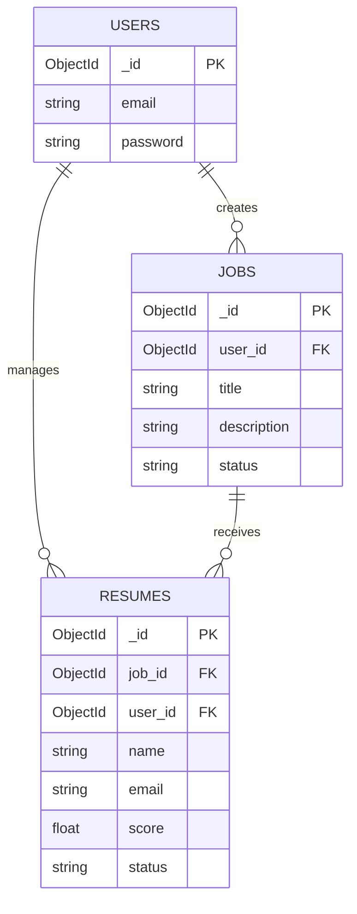
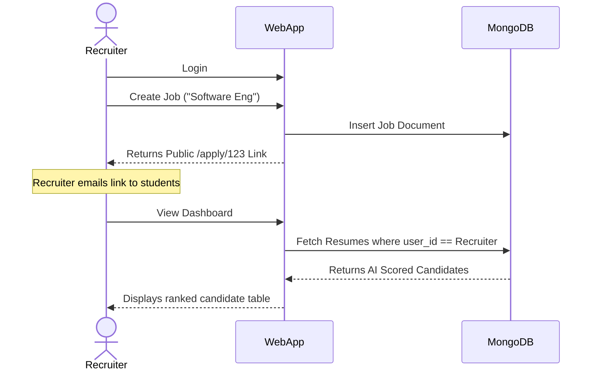
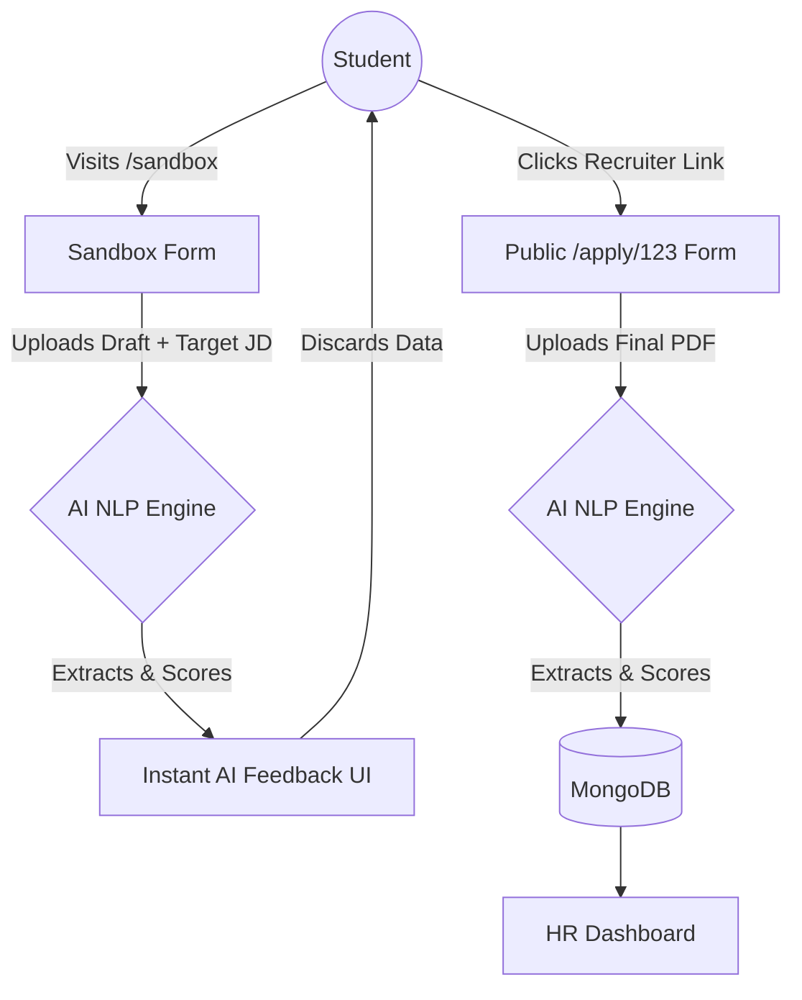

# System Architecture & Technical Design

## 1. Project Direction & Evolution
The project originally started as a basic **Resume Parser**—a simple script to read a PDF and extract text. However, to solve real-world HR problems, the project's direction deliberately evolved into a comprehensive **Dual-Sided Platform**:
1. **B2B (Business-to-Business) ATS:** A robust portal for T&P Cells and Recruiters to manage job postings, generate application links, and rank candidates using Semantic AI.
2. **B2C (Business-to-Consumer) Sandbox:** A public-facing "Resume Coach" where students can test and improve their resumes against target job descriptions *before* officially applying.

---

## 2. Core Features
### For T&P Cells / Recruiters
* **Authentication:** Secure login and session management.
* **Job Requisition Management:** Create, list, and close Job Postings.
* **Public Link Generation:** Generate unique `/apply/<job_id>` URLs for candidates.
* **AI Candidate Ranking:** Automated semantic scoring of applicants against the specific job description using NLP (`SentenceTransformers`).
* **Candidate Pipeline:** Split-screen profile view with manual stage overrides (Review, Shortlisted, Hired, Rejected).
* **Automated SMTP:** Trigger automated status emails to candidates directly from the pipeline.

### For Students / Candidates
* **Public Application Portal:** A clean, branded form to apply directly to a specific job link.
* **AI Resume Sandbox:** A standalone `/sandbox` tool that provides instant, private AI feedback (Matched Skills vs. Missing Skills) without saving data to the recruiter's database.

---

## 3. Directory Structure
```text
ai_resume_ranker/
│
├── app.py                     # Main FastAPI/Flask Application Controller
├── requirements.txt           # Python dependencies
├── .env                       # Environment variables (Mongo URI, SMTP keys)
├── PROJECT_DOCUMENTATION.md   # High-level business documentation
│
├── static/                    # Frontend Assets
│   └── styles.css             # Vanilla CSS design system
│
└── templates/                 # HTML Views (Jinja2)
    ├── base.html              # Main layout wrapper
    ├── dashboard.html         # Recruiter overview & candidate table
    ├── jobs.html              # Job management & link generation
    ├── apply.html             # Public job application form
    ├── candidate_profile.html # Split-screen recruiter view
    ├── sandbox.html           # Public student resume analyzer form
    └── sandbox_results.html   # Student AI feedback view
```

---

## 4. Database Schema (Entities & Relations)
We use a NoSQL approach (MongoDB), but the logical relationship acts like a relational database where Resumes are bound to Jobs, and Jobs are bound to Users.

### Collection: `users` (Recruiters)
| Field | Type | Description |
| :--- | :--- | :--- |
| `_id` | ObjectId | Primary Key |
| `email` | String | Recruiter login email |
| `password` | String | Hashed password |

### Collection: `jobs` (Job Postings)
| Field | Type | Description |
| :--- | :--- | :--- |
| `_id` | ObjectId | Primary Key |
| `user_id` | ObjectId | Foreign Key -> `users._id` (Owner) |
| `title` | String | e.g., "Software Engineer" |
| `description`| String | Full job requirements |
| `keywords` | String | Target comma-separated skills |
| `status` | String | "Open" or "Closed" |
| `created_at` | Datetime | Timestamp of creation |

### Collection: `resumes` (Candidates)
| Field | Type | Description |
| :--- | :--- | :--- |
| `_id` | ObjectId | Primary Key |
| `job_id` | ObjectId | Foreign Key -> `jobs._id` |
| `user_id` | ObjectId | Foreign Key -> `users._id` (For fast dashboard querying) |
| `name` | String | Candidate Name |
| `email` | String | Candidate Email |
| `score` | Float | AI Semantic Match Score (0-100) |
| `matched_skills`| Array | List of strings |
| `missing_skills`| Array | List of strings |
| `tag` | String | "Excellent", "Good", or "Poor" |
| `status` | String | Pipeline stage (e.g., "Review", "Hired") |
| `resume_text` | String | Raw OCR extracted text |

---

## 5. Entity-Relationship Diagram (ERD)



---

## 6. System Workflows

### A. The B2B Recruiter Workflow (Job Creation & Ranking)


### B. The B2C Student Workflow (Sandbox vs. Application)


## 7. Technical Implementation Details
* **NLP & Scoring Logic:** The core AI uses `pdfminer` and `pytesseract` to normalize incoming data into strings. It then utilizes `spaCy` for NER (Named Entity Recognition) to find basic keywords, and `SentenceTransformers` to generate vector embeddings. The cosine similarity between the resume vector and the job description vector determines the final ranking score.
* **Memory Optimization:** Because `SentenceTransformers` requires significant RAM, the model is globally initialized as `None` and "lazy-loaded" inside a singleton wrapper function. This prevents the web server from hanging during deployment startups.

---

## 8. Architectural Trade-offs: Local NLP vs. Managed LLM APIs (e.g., Google Gemini)

As the project scales toward deployment, a major architectural consideration is whether to replace the heavy local NLP models (`SentenceTransformers` and `spaCy`) with a cloud-based LLM API like Google Gemini. 

**The Argument for Gemini API (Deployment Optimization):**
* **Drastically Lower RAM Requirements:** Moving the semantic reasoning to a managed API would remove the need to load heavy machine learning models into the server's memory. The application could run comfortably on a free-tier 512MB cloud instance.
* **Advanced Contextual Understanding:** Gemini could provide richer, conversational feedback for the Student Sandbox, going beyond simple keyword matching to suggest actual phrasing improvements.

**The Argument against Gemini API (Loss of Core Identity):**
* **Loss of Core Engineering Functionality:** The core technical achievement of this project is the custom engineering of an isolated, mathematical semantic search engine (using cosine similarity on vector embeddings). Replacing this with a single API call to Google essentially reduces the project from a "Custom Machine Learning Application" to a simple "API Wrapper".
* **Data Privacy (PII):** Resumes contain highly sensitive Personally Identifiable Information (PII). A core selling point of a true ATS is data governance. Using a local NLP model ensures that candidate data never leaves the recruiter's secure database. Sending thousands of resumes to a third-party LLM introduces severe privacy and compliance risks.
* **Vendor Lock-in & Cost:** Scaling the platform with a local model requires standard server costs. Scaling with Gemini introduces per-token API costs which can become prohibitive in a high-volume T&P Cell environment. 

**Conclusion:** 
While a managed API solves deployment memory constraints, the current architecture utilizing localized NLP was specifically chosen to maintain engineering integrity, data privacy, and cost control.
